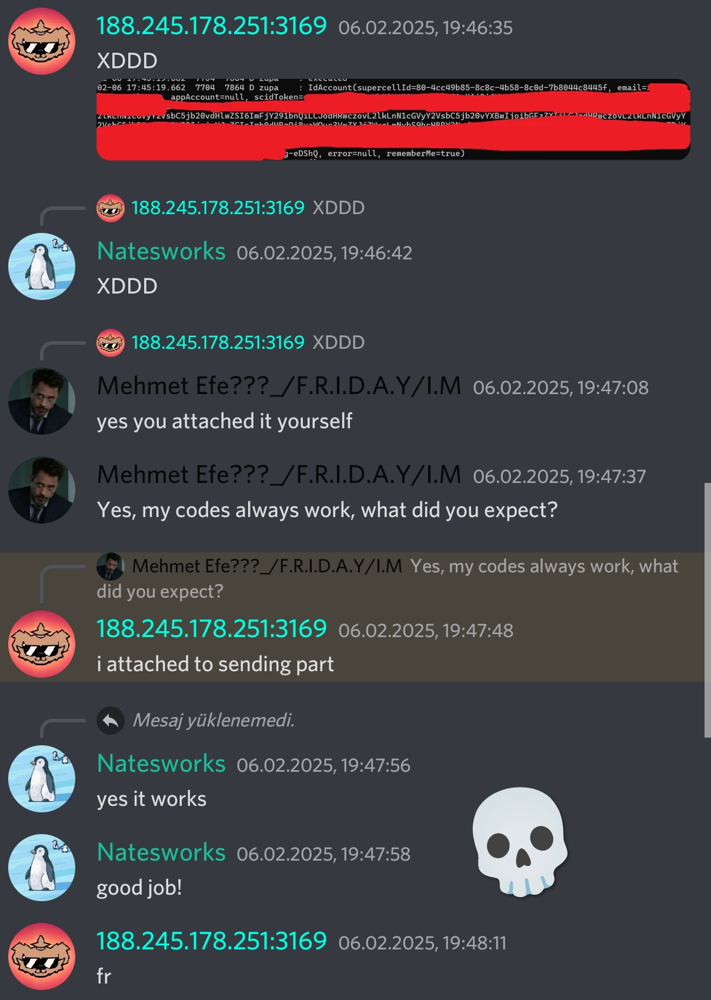
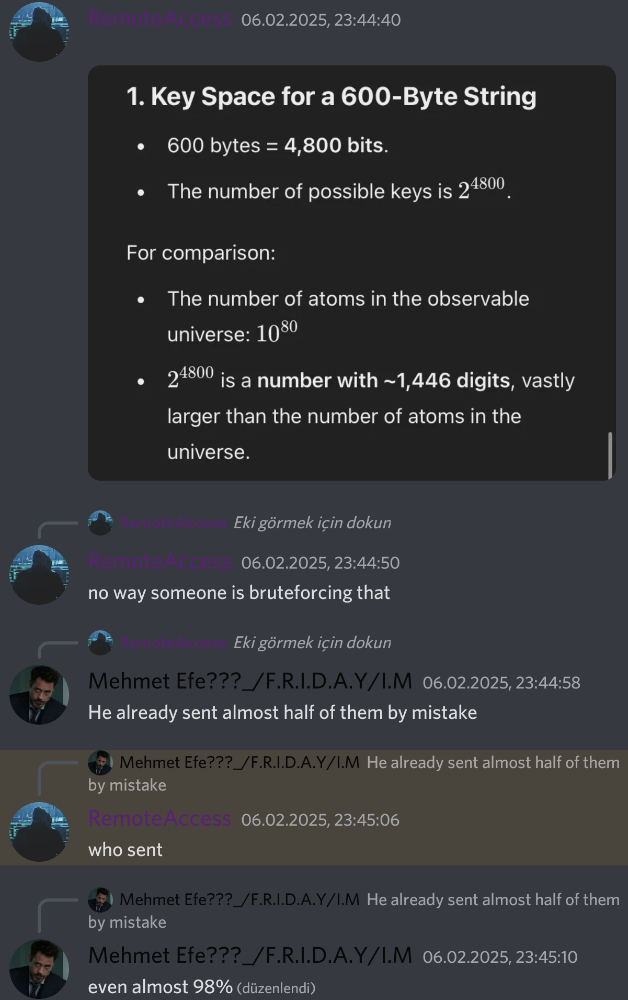
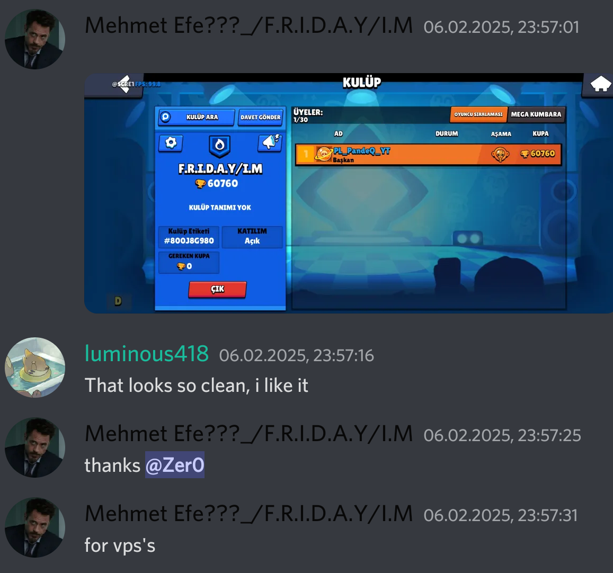
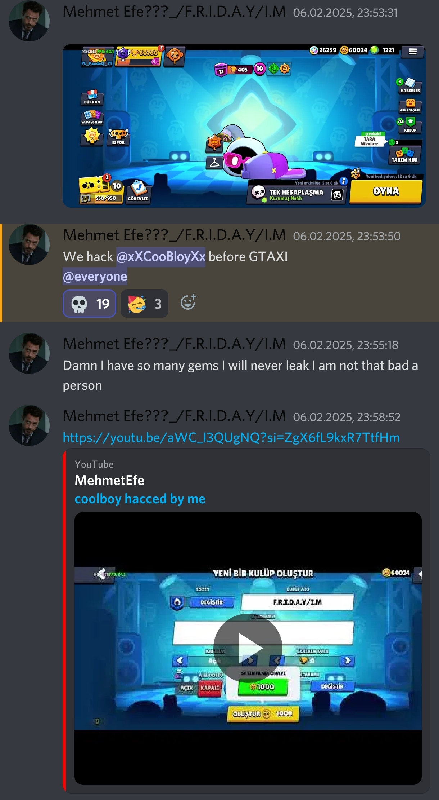
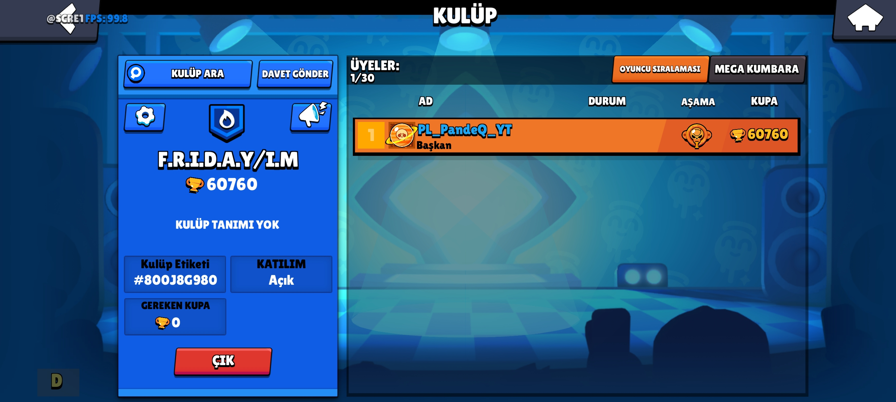
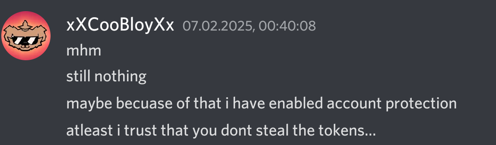

# EXPLANATION ABOUT SCID TOKEN STEALING CLAIMS

Okay, the whole thing starts with the ridiculous claims of someone called coolboy. First of all, let's start from the beginning regarding the idiots who claim I stole scid tokens: erder, coolboy, natesworks. They are all idiots here, and here's why:

First of all, my Mod has remote script updates, so network requests are normal. This idiot named coolboy first made a tcp request sent to the IP 188.245.178.251:3169, and in the first request, I only sent 2 bytes of data, which only writes the script version, and then the XORed version of the script. These idiots, not even knowing how to use reqable properly, sent the header part instead of the sent data and claimed it was 50 bytes. They are extremely stupid. The header part is not the content, I guess I need to explain this to idiots like them. You can understand how stupid these people are just from this.
photos:
 

Another point is the unused libformo**ddd**es.script.so file in the Apk of the first version of my Mod. The actually used file is libformo**dd**ers.sceipt.so.
This is how it is: I do everything from my phone. I grant file permissions to my Frida scripts and pull them from the file path because there is no Frida server since it's from the phone. So, instead of updating the apk every time, I update the script, like this:
```js
{
    "interaction": {
        "type": "script",
        "path": "/storage/emulated/0/BSJS/script/script.js"
    }
}
```
and when creating the apk of my mod, I remove these parts and use my own remote script update code and update my config file. But at the same time, I sent a code to my friend Anıl (Vetal Phoenixe) to test the mod, and that code was libformo**ddd**es.script.so. This script is in my moddable apk. The scid part and other parts are just code left to steal someone's account for fun because Gene Brawl steals tokens, and I thought, "Why shouldn't I steal on their behalf?" but it doesn't work anyway. I'll explain that part too. Instead of bothering to delete the code and just leave the function parts, I wrote my own kit script under the same code. If that script were the actually used code, the credit part would be at the top. Even beyond that, this Frida script is **NOT USED** in my mod, and I forget to delete this file, libformo**ddd**es.script.so, when publishing the mod.
In the libformo**ddd**es.script.so file, there is supposedly a code that claims I steal scid tokens [here](https://github.com/Erder00/Frida-Scripts/blob/main/Brawl%20Stars/special/libformodders-v59.js)
Is this code true? Yes, it really is, but this is not the code used, and moreover, the part of the code that obtains the scid token doesn't even work. This is also extremely stupid. Erder's method of getting the scid value in the supposedly leaked script:
```js
IdAccount.toString.overload().implementation = function () {
        const result = this.toString();
        const sd = this.sd.value;
        const el = this.el.value;
        const st = this.st.value;
```
what it should be:
```js
    IdAccount.toString.overload().implementation = function() {
        var result = this.toString();
        var sd = this.supercellId.value; //supercellId
        var el = this.email.value; //email
        var st = this.scidToken.value; //scidToken
```
These idiots are so stupid that they think these meaningless values will be found in dex: ```this.el.value this.st.value this.sd.value```. This is literally trying to get a non-existent null value. I think I need to teach these people Frida, Javascript, and JADX to explain this. Frida cannot find these values. There is no this.st.value in dexs, there is this.scidToken.value. And then Erder writes this on top of the supposedly leaked script:
```
// THIS SCRIPT WILL STEAL YOUR TOKEN!!! CAUTION WHEN USING THIS!
// script has the famous kit exploit for v59
// To disable the token grab, set the host (line 98) to 127.0.0.1 or something
```
I don't even know which one to criticize: whether it's the supposedly leaked script trying to get non-existent values and actually failing to steal tokens, or publishing the entire script instead of just taking the kit part from the script and publishing it, and then advising something ridiculous like changing the IP while slandering me. You understand why I called these people idiots. If they are reading this, they shouldn't be offended. I spent hours trying to explain this. If they still don't understand, they are idiots.
And then coolboy came to my server. Also, another idiot named natesworks, who is extremely stupid, whatever. Then I sent these idiots this script so they could understand the difference between a null value and a valid value, i.e., the difference between ```this.scidToken.value``` and ```this.st.value```. Then this moron coolboy ran the script and sent the output of the running script and said, "Look, it works, so you are stealing scid token data." DAMN IT! At that moment, I realized these people are highly autistic. He literally ran the code I sent him, which was not in my mod and which was meant to get the scid token, and said, "Yes, this works, so you are stealing scid tokens." The irrelevance and stupidity of these people don't end there. Also, screenshots so you might not believe this extremely stupid thing happened:
 
Coolboy constantly continues to claim that the kit and immortality script I published in the announcements section of my Discord server, which is actually used in my code, is fake and that what is really in the code is not that, because of these events. Then I say, "If you think so, decrypt the data using the decrypt function in the supposedly leaked script in Erder's GitHub repo and prove it." These people don't even know how to use reqable yet. Then they take the tcp request and say it contains tls 💀💀💀 and they think it's an https request. DAMNN.
Anyway, then they continued to talk behind my back, etc. I didn't care about them, and then I told them I was writing an article, which is this article. Actually, I wasn't writing that article at that moment; what I was dealing with at that moment was a scid token bruteforcer. To be honest, it works if a maximum of 6 letters, etc., are unknown. And guess what happened? Coolboy forgot to blur something in a photo while sending me the working scid stealer (he still hasn't noticed; I deleted the photo so others wouldn't take advantage of it). The bad thing is that the photo was cropped from the bottom, and the last 6 letters were missing, damn.
Then I asked my damn slave ChatGPT about all possible combinations, and it said 3 Billion, bruhhh.
I wrote a undici-based scid token bruteforcer for about an hour. I asked my friend zer0 for 4 vps, and he gave me 4 vps with 16GBIT power.
It started bruteforcing for the remaining 3 hours. At first, I kept getting ratelimited. Then I asked zer0 for proxies, and he sent a large list. Then, because the proxy was delaying a bit, I increased the asynchronous structure too much.
and after 2.5 hours, around 11:45 PM Turkish time, it was successful. The possibilities were already running out. 20 minutes beforehand, I wrote in the chat on my server that I had done it. Everyone's reactions were these:

      

After that, CoolBoy was very surprised. He didn't even write a message for the first 10 minutes. I guess he didn't know me very well. He thought I would destroy his account. He had 1200 diamonds in his account, and it seemed like he valued his account. I didn't do anything to his account.
 
And the result:

There are many more events, but I wasn't going to publish this article normally. Then I decided to publish it because these sons of bitches are bothering me morning and evening like they have no life. I wanted to expose their ignorance, how they are "ChatGPT guys", and also to explain myself clearly.
Edit: After these events, I became friends with CoolBoy. But some idiots still continue to pursue these claims, but we all know that Gene Brawl steals SCID Tokens, but nobody is doing anything about it. Anyway, I don't care anymore. This will be my last explanation.