# SCID TOKEN ÇALMA İDDİALARI İLE İLGİLİ AÇIKLAMA

Tamam olay coolboy denen birisinin saçma iddialarıyla başlıyor öncelikle olaya baştan başlayalım benim scidtokenleri çaldığımı iddia eden aptallar: erder, coolboy, natesworks they all idiot here its thats why:

Öncelikle Modumda uzaktan script güncelleme bulunuyor yani ağ istekleri normal Bu coolboy isimli gerizekalı önce 188.245.178.251:3169 ipsine gönderilen tcp isteğini attı ve ben sadece ilk istekte 2 byte gönderilen veri olduğunu oda sadece script versiyonu yazıyor ve sonra scriptin xorlanmış hali yazıyor bu aptallar ise daha reqable kullanmasını bilmeyip gönderilen datayı değil header kısmını gönderip 50 byte olduğunu iddia ediyorlar aşırı gerizekalılar zaten header partı içerik demek değilki sanırım bunu aptallara anlatır gibi anlatmam lazım daha buradan bile bu kişilerin ne kadar salak olduğunu anlayabilirsiniz.
fotolar:
 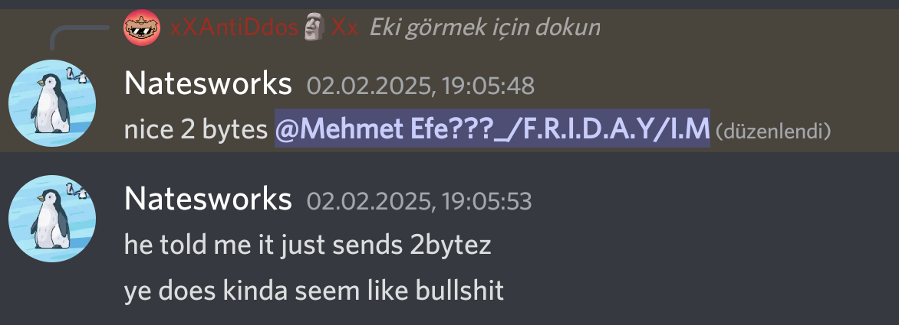

Bir diğer kısım ise Modumun İlk versiyonundaki Apkda olan kullanılmayan libformo**ddd**es.script.so dosyası gerçek kullanılan dosya libformo**dd**ers.sceipt.so.
Bu olay ise şöyle ben herşeyi telefondan yapıyorum frida scriptlerimi dosya izni verip dosya yolundan çekiyorum çünkü telefondan olduğu için frida server yok bu yüzden her seferinde apkyı güncellemek yerine scripti güncelliyorum yani böyle:
```js
{
    "interaction": {
        "type": "script",
        "path": "/storage/emulated/0/BSJS/script/script.js"
    }
}
```
ve modumun apksını oluştururken bu kısımları kaldırıp kendi uzaktan script update kodumu kullanıyorum ve config dosyamı güncelliyorum ama aynı zamanda arkadaşım Anıl(Vetal Phoenixe) modu test etmesi için bir kod atmıştım ama o kod ise libformo**ddd**es.script.so bu script benim moddable apkda bulunuyor scid kısmı ve diğer kısımlar ise sadece gene brawl token çaldığı neden bende onlar adına çalmayayım dediğim için bir kişinin hesabını eğlencesine çalmak için bırakılmış bir kod ama zaten çalışmıyor o kısmıda anlatacağım bende üşenip kodu silip fonksiyon kısımlarını bırakmak yerine aynı kodun altına kendi kit scriptimi yazdım. zaten gerçek kullanılan kod eğer o script olsaydı credit partı en üstte olurdu onu bile geçtim modumda bu frida scripti **KULLANILMIYOR** ve bu dosyayı yani libformo**ddd**es.script.so modu yayınlarken silmeyi unutuyorum
libformo**ddd**es.script.so dosyasında sözde scidtoken çaldığımı iddia eden bir kod bulunuyor [işte](https://github.com/Erder00/Frida-Scripts/blob/main/Brawl%20Stars/special/libformodders-v59.js)
bu kod doğrumu evet gerçektende öyle ama kullanılan kod bu değil ve üstelik kodun scid tokeni elde eden kısmı çalışmıyor bile bu bile aşırı aptalca erderin sözde sızdırılan scriptindeki scid value alma methodu:
```js
IdAccount.toString.overload().implementation = function () {
        const result = this.toString();
        const sd = this.sd.value;
        const el = this.el.value;
        const st = this.st.value;
```
olması gereken:
```js
    IdAccount.toString.overload().implementation = function() {
        var result = this.toString();
        var sd = this.supercellId.value; //supercellId
        var el = this.email.value; //email
        var st = this.scidToken.value; //scidToken
```
Bu aptallar o kadar gerizekalıki dexteki bu anlamsız valuelerin bulunacağını sanıyorlar: ```this.el.value this.st.value this.sd.value``` bu bildiğin olmayan null bir değeri almaya çalışmak sanırım bunu anlatmak için bu kişilere frida ve javascript ve JADX öğretmem gerekiyor frida bu değerleri bulamaz zaten dexlerde this.st.value yok this.scidToken.value var ve sonra sözde sızdırılan scriptin üstüne erder bu yazıyı yazıyor:
```
// THIS SCRIPT WILL STEAL YOUR TOKEN!!! CAUTION WHEN USING THIS!
// script has the famous kit exploit for v59
// To disable the token grab, set the host (line 98) to 127.0.0.1 or something
```
sözde sızdırılan scriptin olmayan değerleri almaya çalışıp aslında tokenleri çalmayı başaramamasımı yoksa kit kısmını sadece scriptten alıp yayınlamak yerine tamamını yayınlayıp hem bana iftira atıp ipyi değiştirmek gibi saçma birşeyimi tavsiye etmesinimi hangisini eleştireceğimi bilemiyorum neden bu kişilere aptal dediğimi anlamışsınızdır. eğer bunu okuyorlarsada alınmasınlar saatlerimi bunu anlatma çalıştım eğer hala anlamıyorlarsa aptallardır.
Ve sonra coolboy sunucuma geldi ayrıca aşırı aptal kişi olan natesworks isimli bir diğer aptalda herneyse sonrs ben bu aptallara null value ile valid value farkını yani ```this.scidToken.value``` ile ```this.st.value``` farkını anlasınlar diye bu scripti yolladım sonra bu gerizekalı coolboy scripti çalıştırdı ve çalışan scriptin çıktısını atıp bak işte çalıştı yani sen scid token verilerini çalıyorsun dedi LANET OLSUN o an bu kişilerin üst düzey otistik olduğunu anladım bildiğin benim modumda olmayan benim ona gönderdiğim scid tokeni almaya yarayan kodu çalıştırıp evet bu çalışıyor yani sen scid tokeni çalıyorsun diyordu aradaki alakasızlığı ve kişilerin aptallığı buradada bitmiyor. ayrıca bu aşırı aptal şeyin yaşandığına belki inanmazsınız diye ekran görüntüleri:
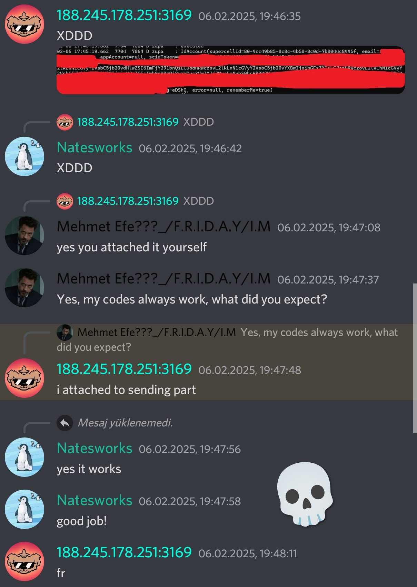 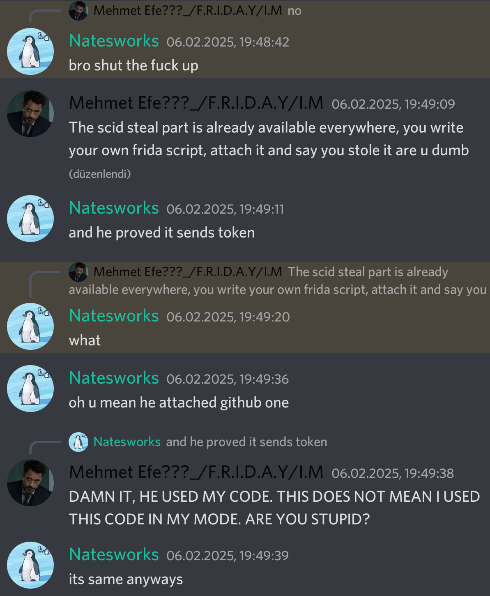
Coolboy sürekli bu olaylardan dolayı benim discord sunucumun duyurular kısmında yayınladığım gerçekten kodumda kullanılan kit ile ölümsüzlük scriptinin sahte olduğunu gerçekten kodda olanın o olmadığını iddia etmeye devam ediyor sonrada bende madem bunu düşünüyorsun erderin github reposundaki sözde sızdırılan scriptindeki decrypt fonksiyonunu kullanarak verileri decrypt edip kanıtla diyorum bu kişiler henüz reqable kullanmayı bile bilmiyor sonra tcp isteğini alıp içinde tls olduğunu söylüyor 💀💀💀 bunun https isteği olduğunu sanıyor DAMNN.
Herneyse sonra ise arkamdan konuşmaya devam ettiler vb. onları umursamadım ve sonra onlara bir yazı yazdığımı onunda bu yazı olduğunu söyledim aslında o an o yazıyı yazmıyordum o an uğraştığım şey scid token bruteforcerdı dürüst olmak gerekirse maxiumum 6 harf vb. bilinmiyorsa işe yarıyor ve bilin bakalım ne oldu coolboy benim ona çalışan attığım scid stealerı atarken bir fotoda blurmayı unuttu(hala farketmedi başkaları yararlanmasın diye fotoyu sildim) kötü şey ise fotoğraf alttan kırpılmıştı son 6 harf eksikti damn.
Daha sonra lanet olası kölem ChatGPT olabilecek tüm olasılıkları sordum 3 Milyar dedi bruhhh.
Yaklaşık bir saat boyunca undici bazlı bir scid token bruteforcer yazdım arkadaşım zer0dan 4 tane vps istedim o ise bana 16GBIT gücünde 4 tane vps verdi.
Kalan 3 saat boyunca bruteforcelemeye başladı ilk başta sürekli ratelimit aldım sonra zer0dan proxy istedim büyük bir liste attı sonra proxylee biraz beklettiği için asenkronize yapıyı aşırı fazla arttırdım.
ve 2.5 saat sonra yaklaşık Türkiye saatiyle saat 23:45 de başarılı oldu zaten olasılıklae bitmek üzereydi 20 dakika önceden sunucumdaki chate bunu yaptığımı yazdım herkesin tepkileri bunlardı:

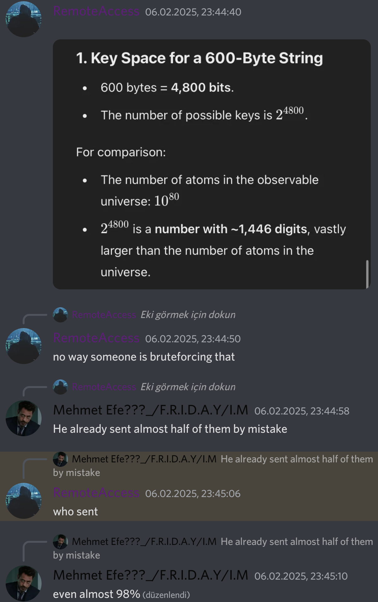 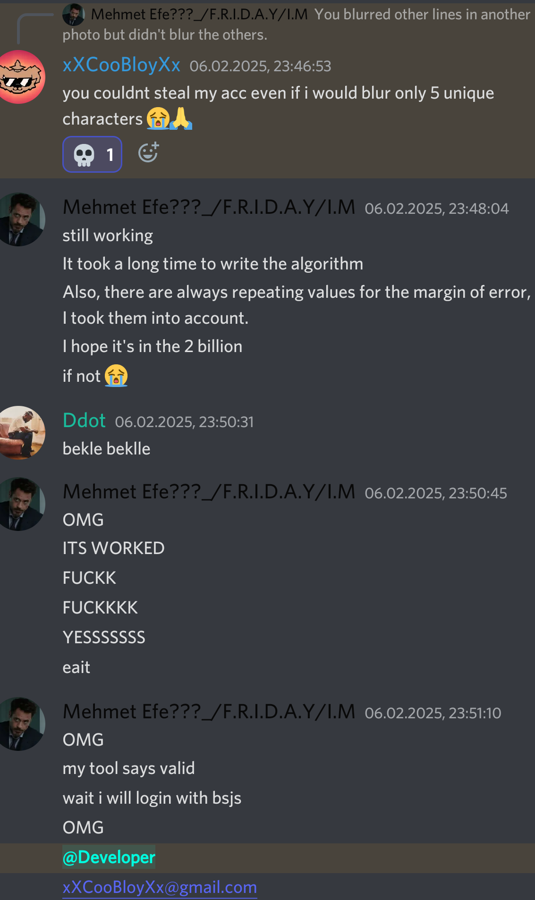 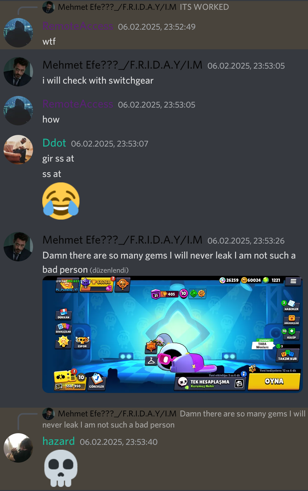 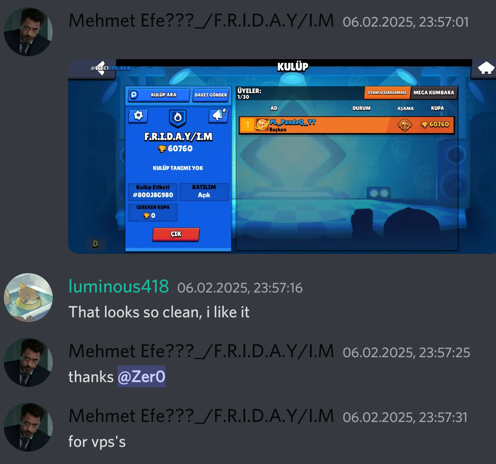 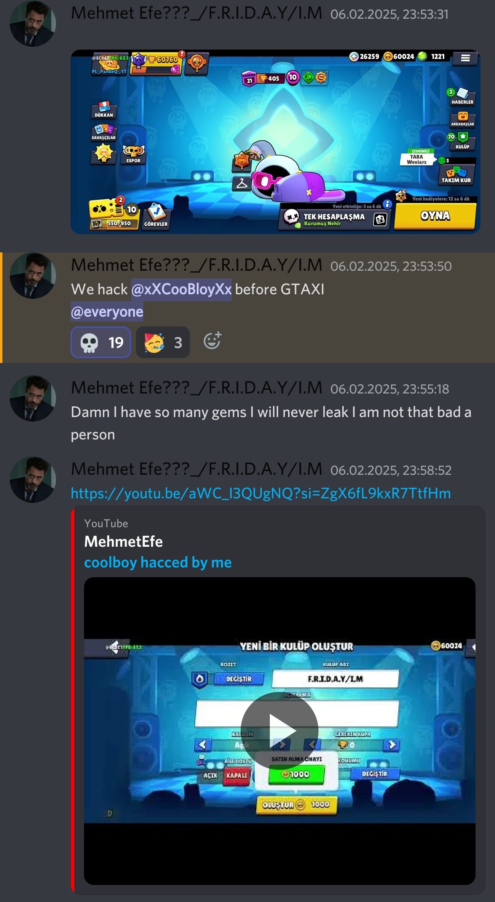 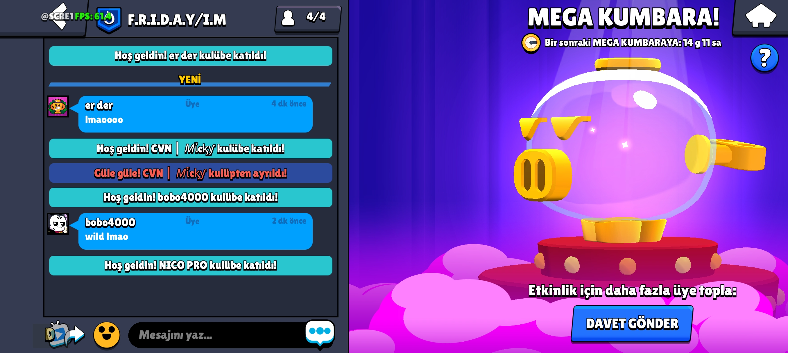 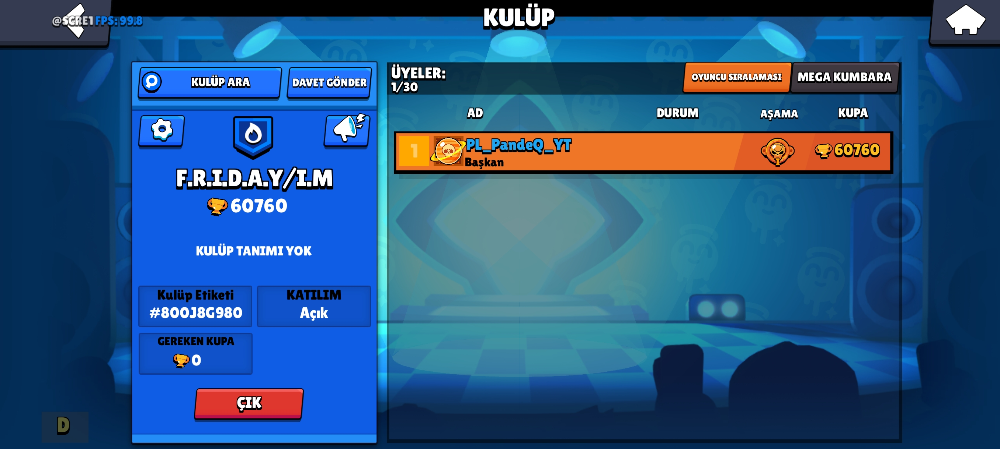

Daha sonra CoolBoy çok fazla şaşırdı hatta ilk 10 dakika mesaj yazmadı sanırım beni pek tanımıyordu heaabını yok edeceğimi düşündü hesabında 1200 elmas vardı hesabına değer verdiği gözüküyordu bende hesabında hiçbirşey yapmadım.
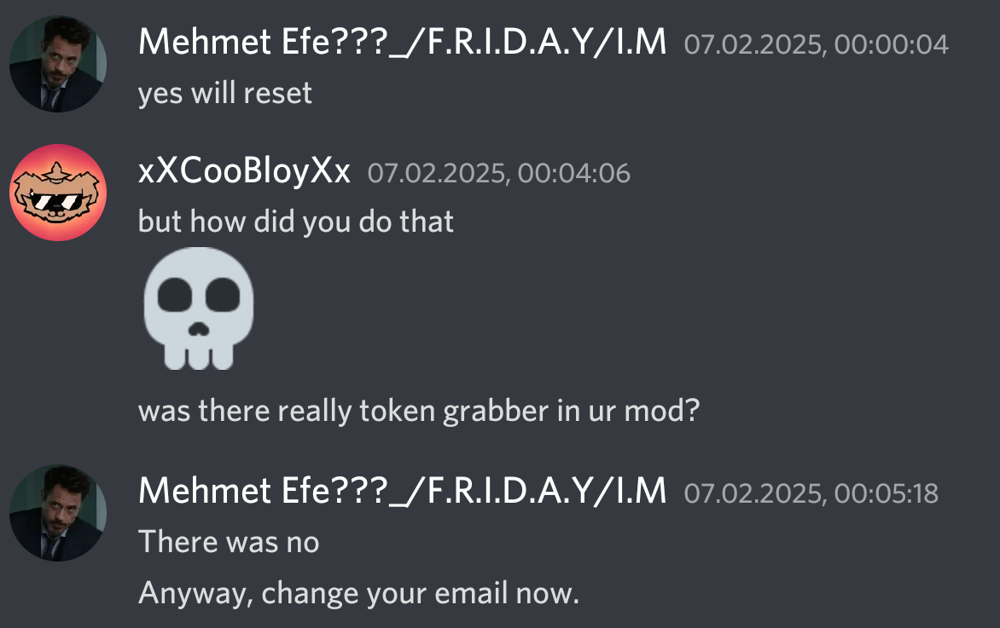 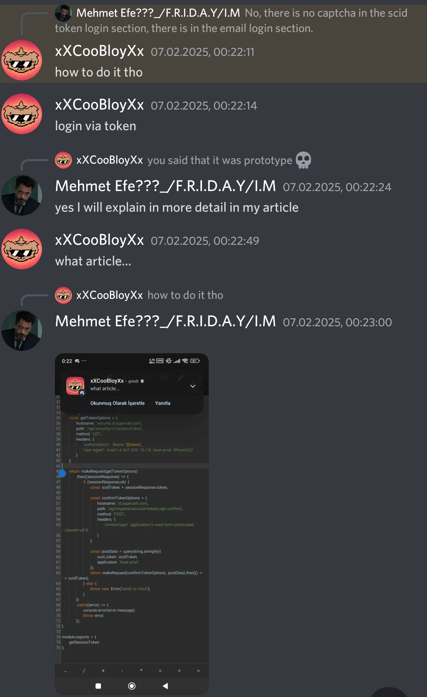
Ve sonuç:
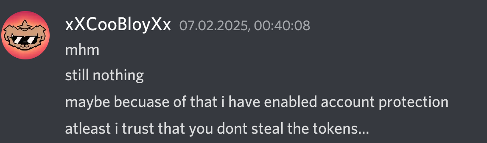
Daha birsürü olay var ama bu yazıyı normalde yayınlamıyacaktım sonra yayınlama kararı aldım çünkü bu oruspu çocukları sabah akşam hayatsız gibi benle uğraşıyor bende bu kişilerin bilgisizliklerini nasıl bir "ChatGPT guy" olduklarını ifşalamak istedim ve kendimi açıkca anlatmakta istedim.
Düzenleme: Bu olaylardan sonra CoolBoyla arkadaş oldum. Ama hala bazı aptallar bu iddiaları sürdürmeye devam ediyor ama hepimiz Gene Brawlın SCID Tokenlerini çaldığını biliyoruz ama bu konuda kimsenin yaptığı birşey yok herneyse artık umurumda değil bu yaptığım son açıklama olacak.
